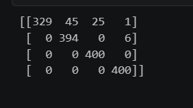
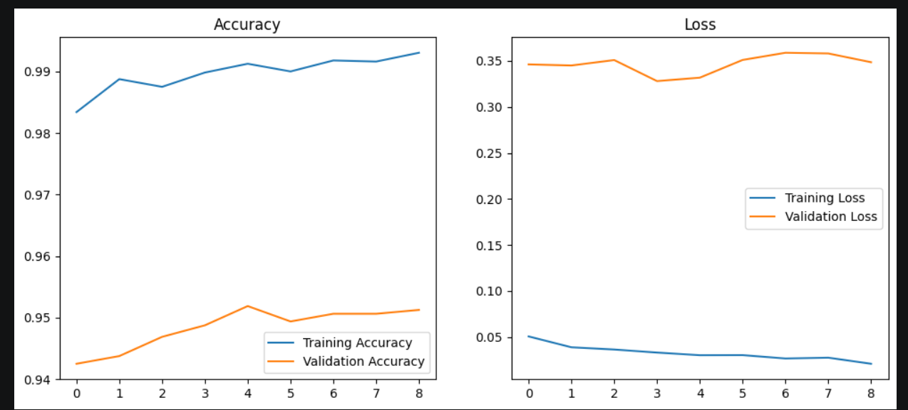
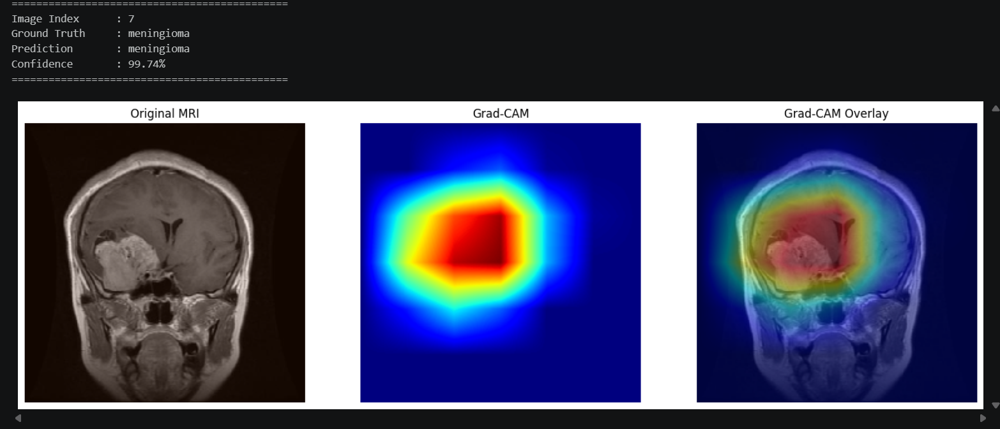

# 🧠 CerebroVision

> **Brain Tumor Classification using Deep Learning & Explainable AI**

A **ResNet50-based deep learning model** for automated brain tumor classification from MRI scans with **Grad-CAM** visual explanations.

       

---

# 📌 Overview

Brain tumor diagnosis from MRI scans is a challenging medical imaging task. CerebroVision demonstrates how **Transfer Learning** with **ResNet50** can accurately classify MRI scans into four brain tumor categories while providing visual explanations through **Grad-CAM**, making the model's predictions more interpretable.

---

# ✨ Features

* 🧠 Multi-class Brain MRI Classification
* 🚀 Transfer Learning using ResNet50
* 🔧 Fine-Tuning of the Pre-trained Model
* 📊 Training & Validation Performance Analysis
* 📈 Confusion Matrix & Classification Report
* 🔥 Explainable AI using Grad-CAM
* 💾 Best Model Saving for Future Inference
* 📂 Well-Organized Training Pipeline

---

# 📂 Dataset

The project is trained on a publicly available **Brain MRI dataset** consisting of four categories:

* Glioma
* Meningioma
* No Tumor
* Pituitary Tumor

The dataset is preprocessed using TensorFlow's **ImageDataGenerator** with data augmentation applied to the training set to improve model generalization.

---

# 🏗️ Model Architecture

The classification model consists of:

* **ResNet50** (ImageNet Pre-trained & Fine-Tuned)
* Global Average Pooling Layer
* Dense Layer (256 Units, ReLU)
* Dropout Layer (0.5)
* Dense Output Layer (Softmax – 4 Classes)

---

# ⚙️ Technologies Used

* Python
* TensorFlow / Keras
* NumPy
* OpenCV
* Matplotlib
* Scikit-learn
* tf-keras-vis
* Google Colab

---

# 📊 Model Performance

| Metric            |      Value |
| ----------------- | ---------: |
| Test Accuracy     | **95.19%** |
| Base Model        |   ResNet50 |
| Number of Classes |          4 |
| Explainability    |   Grad-CAM |

# confusion matrix
# 📈 Confusion Matrix



# 📊 Training Performance



---


# 🔥 Explainable AI

To improve the interpretability of predictions, **Grad-CAM (Gradient-weighted Class Activation Mapping)** is used to generate heatmaps highlighting the MRI regions that contribute most to the model's decision.

This helps visualize where the model is focusing during classification and increases transparency in the prediction process.

---

# 🔥 Grad-CAM Visualization

The Grad-CAM heatmap highlights the regions of the MRI scan that contributed most to the model's prediction.



# 📂 Project Structure

```text
CerebroVision/
│
├── CerebroVision_Training.ipynb
├── README.md
├── requirements.txt
├── .gitignore
│
├── models/
│   └── best_model.keras
│
├── data/
│
└── images/
```

---

# 🚀 Installation

Clone the repository:

```bash
git clone https://github.com/YOUR_USERNAME/CerebroVision.git
```

Navigate to the project directory:

```bash
cd CerebroVision
```

Install the required dependencies:

```bash
pip install -r requirements.txt
```

---

# ▶️ Usage

1. Open **CerebroVision_Training.ipynb**.
2. Load the MRI dataset.
3. Train the model or load the provided trained model.
4. Evaluate model performance.
5. Generate Grad-CAM visualizations.

---

# 📈 Results

The fine-tuned ResNet50 model achieved:

* ✅ **95.19% Test Accuracy**
* ✅ Strong performance across all four MRI classes
* ✅ Robust transfer learning through fine-tuning
* ✅ Explainable predictions using Grad-CAM

---

# 🔮 Future Improvements

* 🌐 Streamlit Web Application
* ☁️ Cloud Deployment
* 📄 PDF Prediction Reports
* 🧠 Additional Explainable AI Techniques (LIME / SHAP)
* 📚 Support for More Brain MRI Datasets

---

# 👨‍💻 Author

**Rishow Kunwar**

B.Tech – Computer Science & Engineering (AI & ML)

Institute of Engineering & Management (IEM), Kolkata

---

# ⭐ Support

If you found this project useful or interesting, consider giving the repository a ⭐ on GitHub.

Feedback and suggestions are always welcome!
